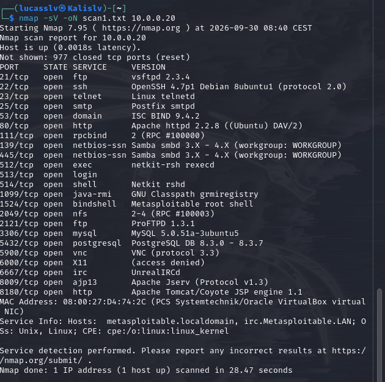
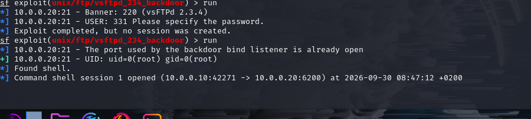
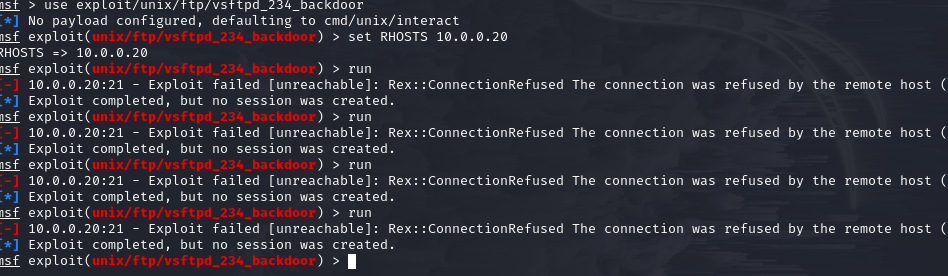

# Home Lab Cybersécurité — Metasploitable 2

Projet personnel réalisé dans le cadre de la construction d'un portfolio pour un stage en cybersécurité.

## Objectif

Monter un petit laboratoire isolé avec deux machines virtuelles pour comprendre, de bout en bout, le cycle : **scanner une machine → exploiter une faille connue → corriger cette faille → vérifier que la correction fonctionne**.

## Environnement

- **Hyperviseur** : Oracle VirtualBox
- **Machine attaquante** : Kali Linux
- **Machine cible** : Metasploitable 2 (machine volontairement truffée de failles, faite pour l'entraînement)
- **Réseau** : les deux VM sont reliées par un réseau interne isolé (nom `labo`), sans accès entre ce réseau et internet ou mon réseau personnel
  - Kali : `10.0.0.10`
  - Metasploitable : `10.0.0.20`

## Étape 1 — Scan de la cible

Depuis Kali, scan de la machine Metasploitable avec `nmap` pour découvrir les services ouverts :

```
nmap -sV -oN scan1.txt 10.0.0.20
```

- `-sV` : cherche la version de chaque service détecté
- `-oN scan1.txt` : sauvegarde le résultat dans un fichier



Le scan révèle une vingtaine de ports ouverts, avec plusieurs services très anciens et connus pour leurs failles. Le plus notable : **vsftpd 2.3.4** sur le port 21.

## Étape 2 — Exploitation de la faille vsftpd 2.3.4

**Le problème** : en 2011, le fichier d'installation officiel de vsftpd 2.3.4 a été piraté et remplacé par une version piégée. Cette version contient une porte dérobée volontaire : si on se connecte en FTP avec un nom d'utilisateur contenant `:)`, le programme ouvre en secret un accès root sur le port 6200, sans aucun mot de passe.

Utilisation de l'outil **Metasploit** (sur Kali) pour reproduire cette faille :

```
msfconsole
search vsftpd
use exploit/unix/ftp/vsftpd_234_backdoor
set RHOSTS 10.0.0.20
run
```

Résultat : accès root obtenu sur Metasploitable.



## Étape 3 — Correction de la faille

**La vraie solution en entreprise** : ce n'est pas un problème de mauvaise configuration, mais un logiciel compromis à la source. La seule correction fiable est de remplacer le logiciel par une version saine (via les dépôts officiels), jamais de conserver un binaire dont l'origine est douteuse. Ça montre aussi l'importance de vérifier l'intégrité d'un fichier téléchargé (empreinte / hash) avant de l'installer.

Sur Metasploitable, arrêt du service vulnérable :

```
sudo service vsftpd stop
```

## Étape 4 — Vérification de la correction

Nouvelle tentative du même exploit depuis Kali, pour confirmer que la faille est bien corrigée :

```
use exploit/unix/ftp/vsftpd_234_backdoor
set RHOSTS 10.0.0.20
run
```

Résultat : connexion refusée, l'exploit ne fonctionne plus.



## Ce que j'ai appris

- Utiliser `nmap` pour cartographier les services d'une machine
- Utiliser Metasploit pour exploiter une faille réelle et documentée
- Comprendre qu'une faille peut venir d'un logiciel compromis à sa source, et pas seulement d'une mauvaise configuration
- Vérifier concrètement qu'une correction fonctionne, en rejouant la même attaque après coup

## Prochaines étapes possibles

- Exploiter d'autres services vulnérables de Metasploitable (Samba, bases de données sans mot de passe)
- Ajouter une application web vulnérable (DVWA) pour travailler l'injection SQL et le XSS
